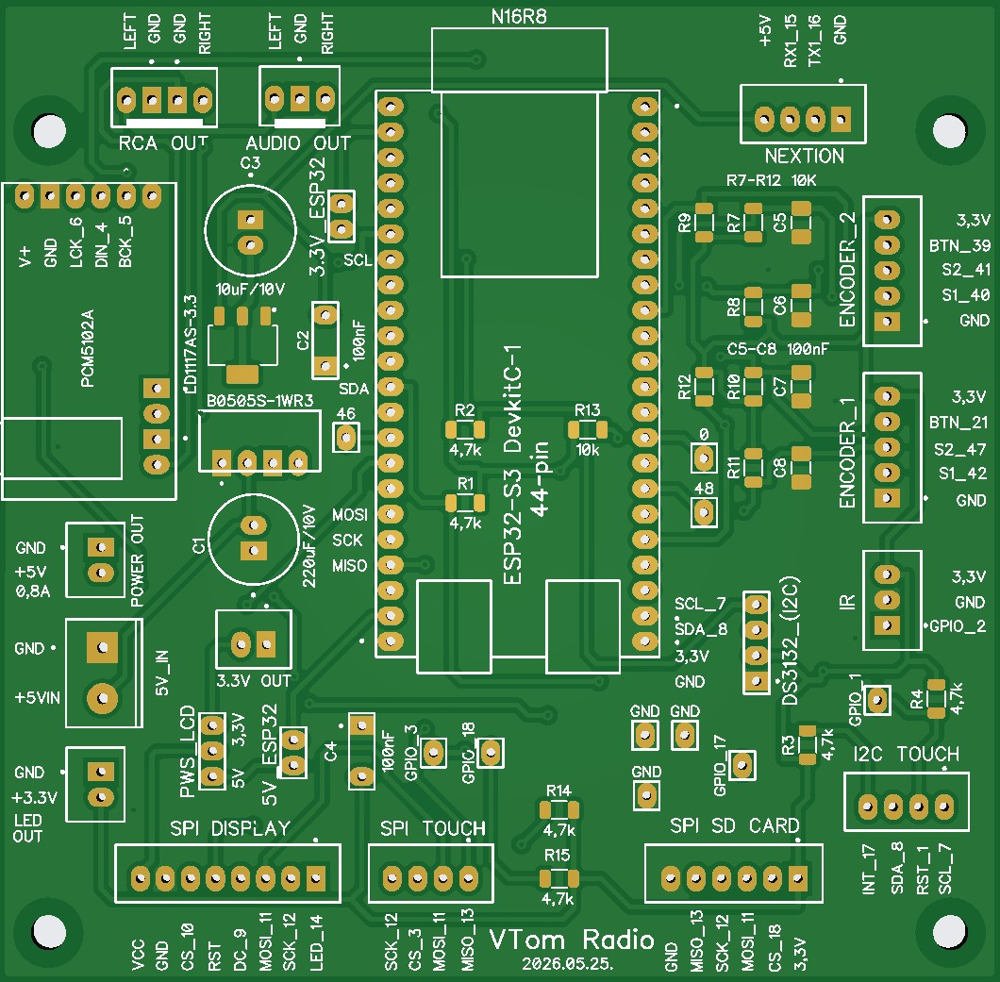
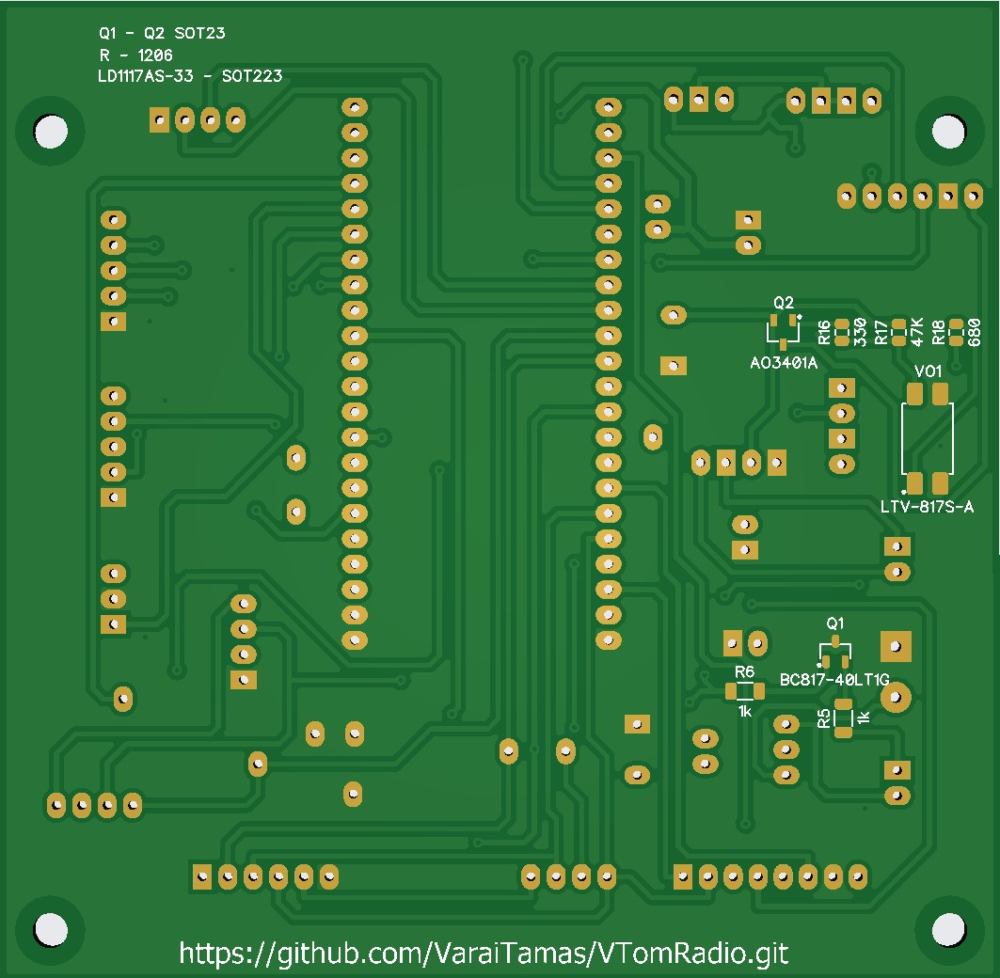

# PCB verzió 2026.05.25
- **PCB mérete:** 98 × 100 mm
- Kapcsolási rajz PDF formátumban letölthető: [schematics_2026.05.25.pdf](../../PCB/PCB_2026_05_25/schematics_2026.05.25.pdf)  
- **R1-R2** az I2C busz SCL és SCA felhúzóellenállásai. 4.7kΩ (Capacitive touch és RTC modul DS3231 használja.)   
- **R3** az I2C TOUCH -> INT GPIO 17 felhúzóellenállása. 4.7kΩ
- **R4** az I2C TOUCH -> RST GPIO 1 felhúzóellenállása. 4.7kΩ   
- "LED OUT" csatlakozó 3.3V-os kimenet a bekapcsoló gomb LED világításának meghajtásához, mely egy BC817 tranzisztorral van kapcsolva a GPIO 38 állapotának megfelelően, a LED GND lábát kapcsolja. Használatával a bekapcsológomb világítása is kikapcsol az ESP alvó állapotában.    
Figyelem!!! Fontos beállítani a myoptions.h fájlban, ellenkező esetben a DAC és a POWER LED nem kapcsol be!!!
```cpp
#define POWER_LED 38
```
- **R5** A POWER LED -et kapcsoló BC817 tranzisztor bázis előtét ellenállása 1kΩ    
- **R6** A POWER LED előtét ellenállása a BC817 taranzisztor által kapcsolt GND ágban 1kΩ   
- **R13** Az ESP32 GPIO 0 -hoz csatlakozó felhúzóellenállás 10kΩ. A GPIO 0 -t a bootloader a boot mód kiválasztására használja. A modulon levő saját felhúzóellenállás nem mindig elegendő, ezért a PCB-n is van egy 10kΩ-os felhúzóellenállás. Elhagyása esetén tapasztalható, hogy a modul csak a második indításra kapcsol be.   

## Az alábbi ellenállásokat nem kell beforrasztani, csak fejlesztéshez vannak kialakítva!!!
- **R14** Az SPI TOUCH -> CS GPIO 3 felhúzóellenállása. 4.7kΩ  
- **R15** Az SPI SD_CARD -> CS GPIO 18 felhúzóellenállása. 4.7kΩ 

## A PCM5102A DAC VIN +5V bemenetét kapcsoló A03401A MOSFET áramkör ellenállásai és működése:
- A PCM5102A DAC VIN +5V bemenetét egy A03401A MOSFET kapcsolja a GPIO 38 állapotának megfelelően. Így a DAC sem kap áramot az ESP alatatásakor.
- **R16** (330 Ω)   
Az optocsatoló kimenete és a MOSFET gate között van. Korlátozza a gate töltő- és kisütőáramát,
csökkenti a kapcsolási tranziens tüskéket és a rezgéseket (ringing),
védi az optocsatoló tranzisztorát a túl nagy impulzusáramoktól.
Nélküle a gate kapacitása rövid ideig nagy áramot vehetne fel.
- **R17** (47 kΩ)   
A gate-et húzza fel a +5 V-ra. Biztosítja, hogy az optocsatoló kikapcsolt állapotában a gate a source feszültségére kerüljön,
így a P-MOSFET biztosan kikapcsolt állapotban maradjon, megakadályozza a gate lebegését.    
- **R18** (680 Ω)   
Korlátozza az optocsatoló LED áramát.
- MOSFET kapcsolás működése:    
Optocsatoló LED kikapcsolva
R17 felhúzza a gate-et +5 V-ra.
Gate ≈ Source.  
MOSFET kikapcsol.   
Optocsatoló LED bekapcsolva.    
Az optocsatoló tranzisztora lehúzza a gate-et a GND felé.
A gate feszültsége kb. 0 V lesz.
A source +5 V-on van.   
A P-csatornás MOSFET bekapcsol. 

Figyelem!!! Fontos beállítani a myoptions.h fájlban, ellenkező esetben a DAC és a POWER LED nem kapcsol be!!!
```cpp
#define POWER_LED 38
```

## Forgó jeleadó - rotary encoder EC11 modul bekötése:
<br><br>   

- **R7, R8, R10, R11** a rotary enkóder felhúzóellenállásai 10kΩ. Nem kell beforrasztani, ha a rotary modulon már van beépítve! 
- **R9, R12** a rotary enkóder gomb felhúzóellenállásai 10kΩ. Nem kell beforrasztani, ha a rotary modulon már van beépítve! 

Ha nincs beépítve a modulon **R7 - R12**, tapasztalatom szerint elegendő bekapcsolni a belső felhúzóellenállásokat a myoptions.h fájlban.
```cpp
/*----- Encoder 1 esetén -----*/
#define ENC_INTERNALPULLUP	true

/*----- Encoder 2 esetén -----*/
#define ENC2_INTERNALPULLUP	true
```

Az encoderek használata esetén a `myoptions.h` fájlban definiálni kell őket:    
```cpp
/*----- ENCODER 1 ------*/
#define ENC_BTNL 42 // S1
#define ENC_BTNR 47 // S2
#define ENC_BTNB 21 // KEY
// #define ENC_INTERNALPULLUP	true
// #define ENC_HALFQUARD true

/*----- ENCODER 2 -----*/
#define ENC2_BTNL 40 // S1
#define ENC2_BTNR 41 // S2
#define ENC2_BTNB 39 // KEY
// #define ENC2_INTERNALPULLUP	true
// #define ENC2_HALFQUARD       true
```
- Ha nem EC11 rotary enkódereket használsz, hanem a nagyobb (EC12) rotary jeladókat ,akkor a `myoptions.h` fájlban engedélyezni kell a fél lépéses működést is:
```cpp
 /*----- Encoder 1 esetén -----*/
#define ENC_HALFQUARD	true

/*----- Encoder 2 esetén -----*/
#define ENC2_HALFQUARD	true
```

## Érintő képernyő 
### SPI buszt használó XPT2046 chip esetén (resistive) 
- Csatlakozó foglalat -> SPI TOUCH
- A T.CK, T.CS, T-MISO, T.MOSI érintkezők az LCD modulon az érintőképernyő SPI vezetékei. Használat esetén mindegyiket be kell kötni. Amennyiben nem akarsz használni érintő kijelzőt és nem kötöd be ezeket, úgy a myoptions.h fájlban kommenteld ki a sor elejére helyezett // jellel az ide vonatkozó definíciókat. Ellenkező esetben mindig a hangerő képernyő jelenhet meg.  

```cpp
/*----- Touch ISP -----*/
 #define TS_MODEL TS_MODEL_XPT2046
 #define TS_CS    3
```

### I2C buszt használó FT6X36 chip esetén (capacitive) 
- Csatlakozó foglalat -> I2C TOUCH
- A myoptions.h fájlban kell engedélyezni ezt a funkciót. 

```cpp
/*----- Touch I2C -----*/
 #define TS_MODEL TS_MODEL_FT6X36
// #define TS_MODEL TS_MODEL_AXS15231B
 #define TS_SCL     7
 #define TS_SDA     8
 #define TS_INT    17 
 #define TS_RST     1
``` 
- További beállítások a WEB UI felületen érhetőek el a program futása közben.
    - flip touch
    - X toutch mirroring
    - Y touch mirroring     

## SD kártya
- Csatlakozó foglalat -> SPI SD CARD
- Használata esetén a myoptions.h fájlban be kell kapcsolni a definíciókat.
```cpp
/* DS CARD */
#define SDC_CS 18
```
## RTC óramodul
- Az I2C csatlakozó alkalmas közvetlenül óramodul RTC DS3231 fogadására. Használata esetén a myoptions.h fájlban be kell kapcsolni a definíciókat. Az óramodul elhagyása esetén a kijelző órája induláskor 00:00:00 időt mutat, amig a netről nem tudja lekérdezni a pontos időt.
```cpp
/* CLOCK MODUL RTC DS3231 */
#define RTC_SCL			     7
#define RTC_SDA			     8
#define RTC_MODULE DS3231
```
## Power-select jumperek       
A PWS_LCD power select jumperek csak tesztelési céllal kerültek fel. Amennyiben a modul tartalmaz saját 3.3V -os stabilizátor IC -t, úgy lehet választani az 5V -os táplálást.

- 5V_ESP32 zárása → az ESP a saját 3.3 V stabilizátorát használja

- 3.3V_ESP32 zárása → az ESP-t az alaplapi stabilizátor táplálja        
Ajánlás: csak az 5V_ESP32 ágat zárd! 

- Kijelzőknél a 3.3V használata javasolt. 4"-os ILI9488 kijelzőnél az 5V -os záróagat érdemes lehet összekötni 2 darab 1N4007 dióda sorbakötésével, így a kijelző 3,8 Voltot kap és erősebb képe lesz tapasztalatom szerint. Az 5 Voltos táplálás instabil működést okozhat.

## Távirányító bekötése:    

- Az IR LED a GPIO 2 -öt használja, mert a távirányítóval való ébresztéshez RTC képes GPIO -ra van szükség.
### Infravörös vevő power szűrő   
<br><br>  
Ha vezetékkel van kivezetve az IR led a tápvezeték összeszed zajokat a környező vezetékek mágneses tere miatt, ezért stabilizálni kell a +5 Voltot a GND hez képest. Ez bevált gyakorlat a háztartási gépeknél is mint például TV vagy klíma.   
A zajt tanításnál lehet észrevenni, mert a távirányító megnyomása nélkül jelennek meg hexadecimális számok, vagy nem tudod ugyanazt a számot generálni egy gomb nyomkodásával.  
Az infravörös led tápjára párhuzamosan kell kötni egy 10μF elektrolit és egy 100nF kerámia kondenzátort, közel az infravevőhöz. 

## Az ESP32-S3-DevKitC 1 N16R8 fejlesztőmodul lábkiosztása.      
<br><br>   

- Az SPI lábak ellenőrzéséhez itt találod a board-variánsokat:  
  https://github.com/espressif/arduino-esp32/tree/master/variants

- Fordítási konfigurációk:  
  https://github.com/sivar2311/ESP32-S3-PlatformIO-Flash-and-PSRAM-configurations
   

## PCB képek:

- A rögzítő furatok és a kűlső méretek nem változtak.   
<br><br>


<br><br>
<br><br>

## Alkatrészek:
| Alkatrész neve    | Érték | Típus    |
|-------------------|-------|----------|     
| R1 - R4           | 4,7k  | SMD 1206 |    
| R5 - R6           | 1k    | SMD 1206 |
| R7 - R13          | 10k   | SMD 1206 |
| R14 - R15         | 4,7k  | SMD 1206 |
| R16               | 330   | SMD 0805 |
| R17               | 47k   | SMD 0805 |
| R18               | 680   | SMD 0805 |
| C1                | 220uF/10V | 2,54 |
| C2                | Kondenzátor 100nF 100V 10% Polipropilén RM-5 | 2,54 |
| C3                | 10uF/10V | 2,54 |
| C4                | Kondenzátor 100nF 100V 10% Polipropilén RM-5 | 2,54 |
| LD1117AS33TR POS.V-REG. | 3.3V 1.2A Low-Drop.(1.15V) | SOT-223       | 
| AO3401A | P-MOSFET SMD 30V (3.8A) | SOT-23 |
| BC817-40.215 NPN SMD 45V/50V 0.5A 0.25W 100MHz | | SOT-23 |
| LTV817STA1 | Optocsatoló 5kV tranzisztor kimenet 35V 50mA 80KHz 4p. SMD 
| Csatlakozók| JST-XH | 2,54 |
### Ha támogatni szeretnéd a munkámat itt meghívhatsz egy kávéra!!!     
<a href="https://buymeacoffee.com/vtom">
    
</a>
