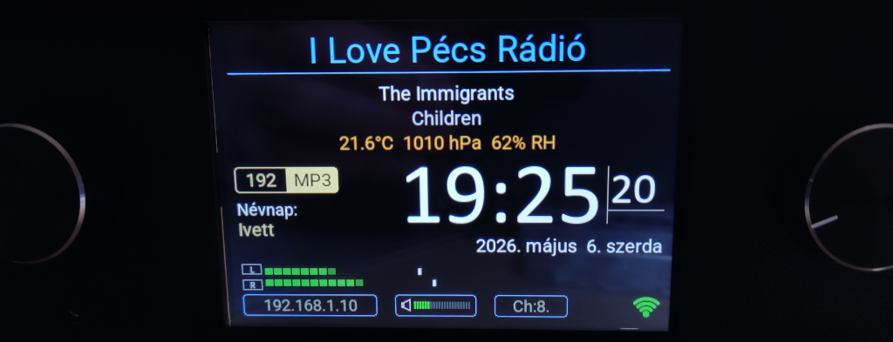

# VTom Radio - ESP32-S3 alapú internetes rádió


### A program alapja ёRadio v0.9.720 https://github.com/e2002/yoradio   
Főbb változtatások:
- LovyanGFX könyvtár használata az AdafruitGFX könyvtár helyett.
- A program TrueType fontokat használ VLW -re konvertált formátumban, élsimítással.
- LittleFS fájlrendszer használata a SPIFFS helyett.
- Kijelző és érintőképernyő meghajtó módosítása.
- Új widgetek bevezetése.
- Kibővített nyelvi támogatás és területi beállítások.
- Névnapok megjelenítése több nyelven.
- Kibővített WEB UI és új funkciók hozzáadása.

---
## VTom Radio
- [Telepítési tanácsok](#telepitesi-tanacsok)
- [Nyelvek, területi beállítások](#nyelvek-teruleti-beallitasok)
- [Névnapok megjelenítése](#nevnapok-megjelenitese)
- [PCB nyomtatott áramkör](#pcb-nyomtatott-aramkor)
- [3D nyomtatási tervek](#3d-nyomtatasi-tervek)
- [Version history](#version-history)

---
## Telepitesi tanacsok
!!! Figyelem !!!
Ez a verzió kizárólag az ESP32-S3-devkit-C1 N16R8, 44 lábú modulhoz és
- ILI9488 480x320 felbontású SPI (LCD) 
- ILI9341 320x240 felbontású SPI (LCD)
- ST7796 480x320 felbontású SPI (LCD)   

kijelzőhöz készült és csak az audioI2S DAC eszközzel működik megfelelően, [PCM5102A](PCM5102A) -val tesztelve!
- A program működéséhez 16MB flash memória és 8MB PSRAM szükséges!
- Arduino Core 3.3.7 használatával tesztelve. Arduino Core 3.3.8 verzióval nem működik megfelelően !!!   

- A programhoz ajánlott a Visual Studio Code szerkesztő használata a PlatformIO plugin-nal, de az Arduino IDE-vel is működik.   
- A Visual Studio Code szerkesztő letölthető innen: https://code.visualstudio.com/    
- Telepítés után a bal oldali menüben EXTENSIONS gombra kattintva a keresőbe írd be: PlatformIO IDE és telepítsd. 
- A projektet a VTomRadio/VTomRadio/VTomRadio.code-workspace fájl megnyitásával tudod elindítani.  
- A program automatikusan letölti a szükséges könyvtárakat, de ha valamiért nem sikerülne, akkor a platformio.ini fájlban megadott könyvtárakat manuálisan is telepítheted.
- Első telepítés előtt célszerű a teljes flash memória törlése az előző verziók maradványainak eltávolítása érdekében!
```
pio run --target erase
```
- Ezután a következő parancsot kell kiadni a kód feltöltéséhez. A program egyedi partíciós táblát használ. A parancs automatikusan létrehozza a szükséges particiókat a gyökérkönyvtárban elhelyezett partitions.csv fájl alapján a 16 MB-os flash memória méretéhez igazítva és feltölti a firmware-t.
```
pio run --target upload
```
- Ezután a WEB UI elemeit, fontokat, képeket kell feltölteni a következő paranccsal.
```
pio run --target uploadfs
```
- Ezek a fájlok könyvtárankén elkülönítve itt találhatóak, ezekkel teendő nincs.
```
        VTomRadio/data/data     Lejátszási lista, jelszó, téma, beállítások, stb.
        VTomRadio/data/www      WEB UI fájlok
        VTomRadio/data/fonts    Betűtípusok
        VTomRadio/data/images   Képek   
```

- Amennyiben mindig a hangerő jelenik meg ellenőrízd a következőket:
   - Az LCD kijelzőn nem szabad bekötni a MISO_13 vezetéket, mert arra nincs szökség!
   - Ha nem használsz touch funkciót, akkor ne definiáld a myoptions.h fájlban, kommenteld ki!  
```cpp
/* Touch */
// #define TS_MODEL TS_MODEL_XPT2046
// #define TS_CS    3
```   

## Nyelvek, teruleti beallitasok:

Aprogram beépített nyelveket és területi beállításokat tartalmaz HU, PL, GR, EN, RU, NL, SK, UA, DE nyelveken.   
A myoptions.h fájlban az alábbi paranccsal állíthatod be.   
```cpp
#define LANGUAGE HU
```


A myoptions.h fájlban beállított pin-ek ajánlottak a helyes működéshez. 

Itt tovább alakítható.
https://trip5.github.io/ehRadio_myoptions/generator.html 

Az ESP modulról itt olvasható:   
esp32-S3-devkit-C1 44 pins https://randomnerdtutorials.com/esp32-s3-devkitc-pinout-guide 

## Nevnapok megjelenitese:
A program képes megjeleníteni a HU, PL, NL, GR, DE nyelvű névnapokat.
- A myoptions.h fájlban az alábbi paranccsal állíthatod be a megjelenítendő névnapokat.   
```cpp
#define NAMEDAYS_FILE HU   
```
A névnapok tárolása az alábbi fájlokban történik.

      VTomRadio/local/namedays/namedays_HU.h
      VTomRadio/local/namedays/namedays_PL.h
      VTomRadio/local/namedays/namedays_GR.h  
      VTomRadio/local/namedays/namedays_DE.h
      VTomRadio/local/namedays/namedays_NL.h
      VTomRadio/local/namedays/namedays_UA.h

Ha más nyelven szeretnéd használni vedd fel velem a kapcsolatot.

A névnapok megjelenítése a WEB-es felületen kikapcsolható options/ SYSTEM-> Nameday gombbal.

## PCB nyomtatott aramkor:
- A PCB nyomtatott áramkör a VTom Radio projekthez készült.    
Itt olvashatsz róla bővebben: [PCB_2026_05_25](PCB/PCB_2026_05_25/readme.md)

## 3D nyomtatasi tervek
- IPS 4.0 Inch, SPI, ILI9488 Factory TFT LCD 480*320, 14 Pin Electronic Board  
(SPI resistive touch XPT2046) https://www.aliexpress.com/item/1005006287831546.html
   - 3D nyomtatási terv --> https://www.printables.com/model/1489380-yoradio-case-for-ips-40-inch-ili9488-tft-lcd-48032
- IPS 3.5 Inch, SPI 14 pin Full View Angle 480*320 displays
   - ILI9488 480x320 felbontású SPI LCD (SPI resistive touch XPT2046) https://www.aliexpress.com/item/1005007789737257.html 
   - ST7796 480x320 felbontású SPI LCD (I2C capacitive touch FT6336) https://www.aliexpress.com/item/1005005995931721.html 
   - 3D nyomtatási terv --> https://www.printables.com/model/1621877-yoradio-case-for-ips-35-inch-spi-480320-capacitive

## Version history: 
### Ha támogatni szeretnéd a munkámat itt meghívhatsz egy kávéra!!!     
<a href="https://buymeacoffee.com/vtom">
    
</a>  

## v0.1.7
- Az ébresztés funkció módosítása az ESP32 WROVER modulhoz.    
   ESP32 WROVER modulnál csak egy ébresztési pin állítható be. Például:
   ```cpp
   #define WAKE_PIN1 ENC_BTNB
   ```   

   ESP32-S3 modulnál két ébresztési pin állítható be. Például:
   ```cpp
   #define WAKE_PIN1 IR_PIN
   #define WAKE_PIN2 ENC_BTNB
   ```

## v0.1.6   
- A POWER LED bekapcsolás idejének változtatása.      
    [A PCB verzio: 206.06.21 együttműködéséhez.](PCB/PCB_2026_06_21/readme.md)
## v0.1.5
- ILI9341 kijelző támogatás hozzáadása. Ez a kijelző 320x240 felbontású, így a megjelenítés kissé módosult, de a program többi része változatlan maradt. (by Scott Barber)
### v0.1.4
- A hangerő 0 - 21 értékeinek személyreszabása érdekében bevezetésre került a VOLUME CURVE, amely lehtővé teszi minden hangerő állás személyreszabását -60 - 0 dB értékek között. A VOLUME CURVE beállítása a WEB UI-ban a hangszínszabályzó lenyitásánál a VOLUME CURVE... gombbal indítható. 
Teljes FLASH memória törlése és a data/ mappa feltöltése szükséges!!
### v0.1.3
- Az óra megjelenítésénén egy számjegy esetén ne jelenjen meg előtte a nulla javítás és a másodperc középreigazítása minden fontnál.
### v0.1.2
- SD kártya módban a képernyő fagyás hibájának javítása. Mostantól a myoptions.h fájlban az SD modot így kell beállítani.
```cpp
/*----- SD CARD -----*/
 #define SDC_CS     18
 #define SD_SPIPINS 12, 13, 11, SDC_CS  // SCK, MISO, MOSI, CS
 ```
- Az RSSI kijelzésénél a villogás hibajának javítása.
- A VU kijelzésnél az L R jelzés hibájának javítása.
### v0.1.1, v0.1.1a
- Csatornaváltásnál a kijelzőn megjelenő hibák javítása.
### v0.1.0
- Első stabil kiadás.   
   Kizárólag az alábbi kijelzők támogatottak:   
   - ILI9488 480x320 felbontású SPI LCD
   - ST7796 480x320 felbontású SPI LCD
### v0.0.10
- A WEB UI-hoz hozzáadva az IR Recorder CSV export és import funkció
- LittleFS-SPIFFS Partition Manager v0.4.0 program hozzáadva. (by Botfai Tibor)  
   [Bővebben itt olvasható.](LittleFS_manager\Readme.md)
- A kijelző óra fontjai bővültek az Android fonttal
- Stabilítási javítások a WEB UI-ban
### v0.0.9
- Kijelző stabilítási javítások, optimalizálás.
- Theme editor használata során ESP32 összeomlásának javítása.
- A data/images könyvtárból kikerültek a wifi ikonok, így a program maga rajzolja ki a megfelelő ikonokat a wifi jel erősségének megfelelően. Ha valaki ragaszkodik a régi ikonokhoz, akkor a data/images könyvtárba visszahelyezheti őket, de azokon a téma editor nem változtatja a színeket. Az ikonok megtalálhatóak az /images mappában.
### v0.0.8 (by Andrzej Jaroszuk)
- DIM állapotváltások javítása
- Képernyőmaradványok javítása a kijelzőn
- IR PLAY/STOP gombok működésének javítása
- Óra megjelenítésének javítása frissítési hibák javítása
### v0.0.7
- LittleFS-SPIFFS_Partition_Manager_v0.3.4 program hozzáadva. (by Botfai Tibor)
- "Serial LittleFS maintance mode" kapcsolása átkerült a WEB UI-ba. Kikapcsolása 4 másodpercel rövidíti a bootolási időt, ha nincs rá szükség.
### v0.0.6 (by Andrzej Jaroszuk)
- Bitrate text betöltési idejének javítása a kijelzőn és a WEB UI-n. (by Andrzej Jaroszuk)
### v0.0.5
- I2S audio könyvtár frissítése V3.4.5-re. https://github.com/schreibfaul1/ESP32-audioI2S
- Induláskor a kijelző fényereje fokozatosan növekszik a beállított értékig (fade in effekt).
- #define USE_SERIAL_LITTLEFS  // Enable Serial LittleFS for maintenance mode (Botfai Tibor)
### v0.0.4
- Custom_themes könyvtár hozzáadása az eredeti téma mellett, egyedi témák tárolásához.
   - MB_fallout3_pipboy_2026-05-08.csv  (by Maciej Bednarski)
   - MB_monochrome_oled_2026-05-08.csv  (by Maciej Bednarski)
- #define IR_NEC_ONLY  // Build only NEC decoder sources from IRremoteESP8266 (faster/smaller build)
- Heapbar túlfutása a kijelzőn, javítva.
### v0.0.3 
- Képernyővédő módban az óra kifutott a kijelzőről, javítva.
- Képernyőmódból visszatérve az óra nem ment vissza a helyére, javítva.
### v0.0.2
- ST7796 kijelző támogatás hozzáadása.
- Kijelző és érintőképernyő meghajtó módosítása.
- WI-FI widget color témájának módosítása.
- Optimalizálás és kisebb hibajavítások.


### Ha támogatni szeretnéd a munkámat itt meghívhatsz egy kávéra!!!     
<a href="https://buymeacoffee.com/vtom">
    
</a>